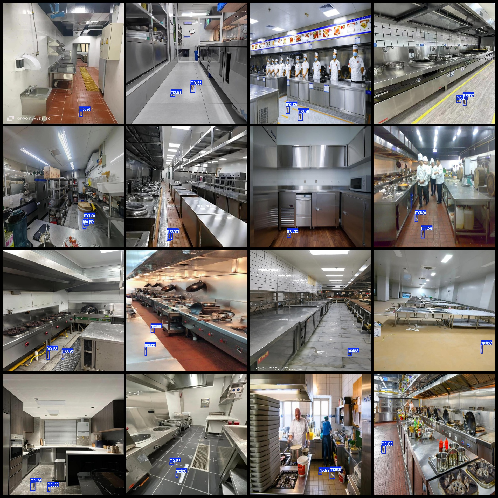
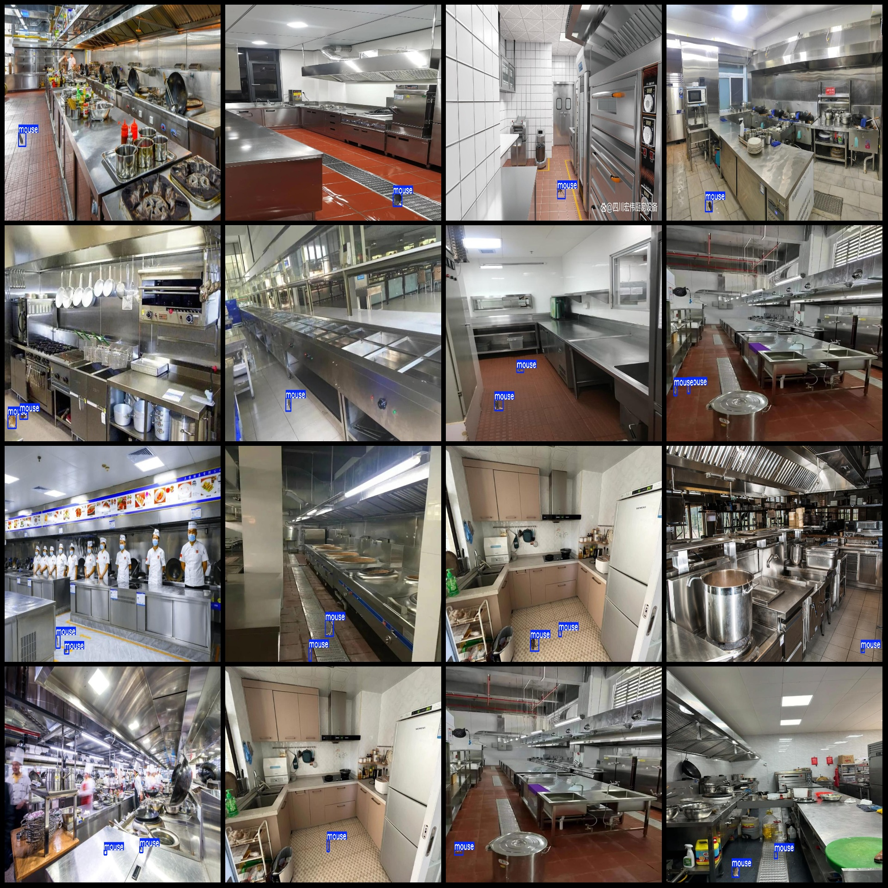
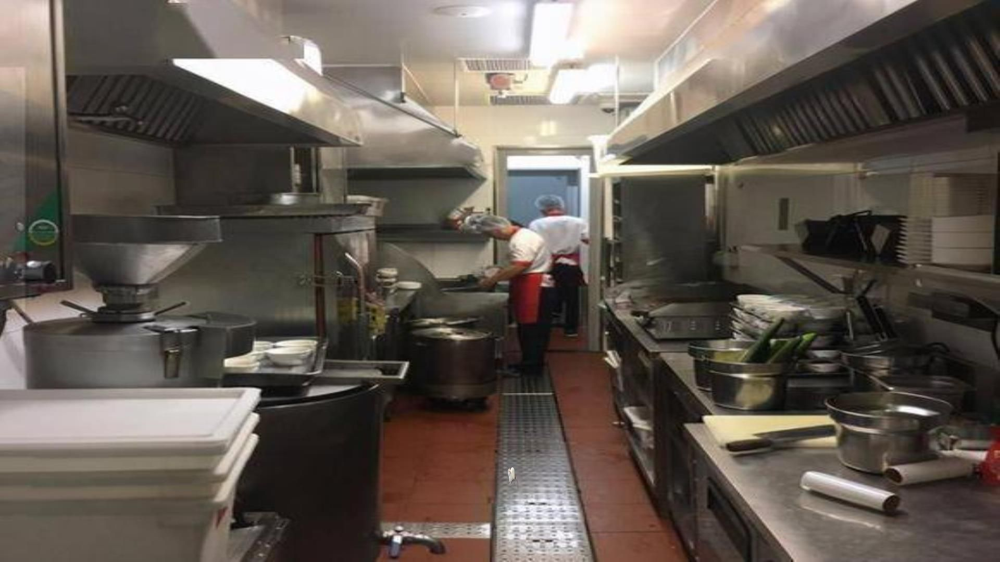
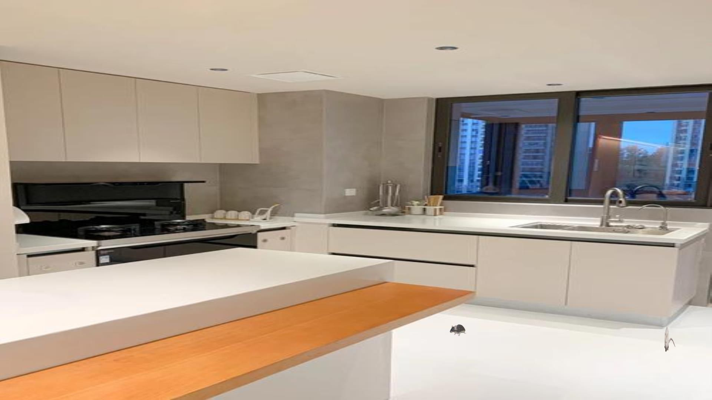
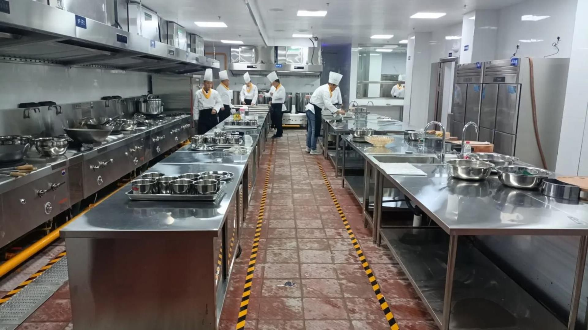
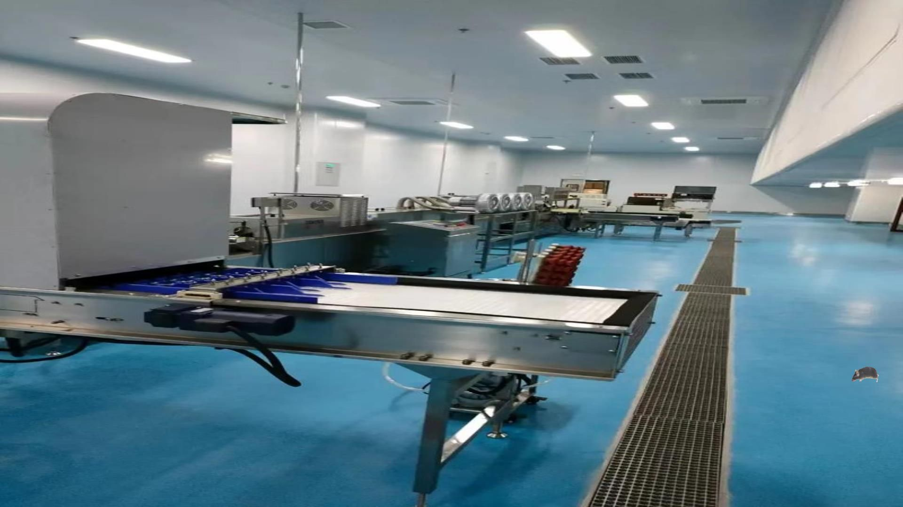

# Smart Kitchen Rat Detection Dataset - VOC+YOLO Format with 3000 Images in 1 Category

Note: All datasets are synthetic images. Please pay attention to the image previews and descriptions.

Dataset format: Pascal VOC format + YOLO format (without split path in the txt file, only containing jpg images along with corresponding VOC format xml files and YOLO format txt files)

Number of images (jpg file count): 3000
Number of annotations (xml file count): 3000
Number of annotations (txt file count): 3000
Number of categories: 1
Annotation category name: ["mouse"]
Number of bounding box instances per category:
- mouse: 4525
Total number of bounding boxes: 4525
Number of images each category occupies:
- mouse: 3000
Image resolution: 1920x1080
Annotation tool used: labelImg
Annotation rule: draw bounding boxes for categories
Important note: The dataset does not have split into training, validation, or test sets; you will need to manually split it.
Special declaration: This dataset does not guarantee the accuracy of the trained models or weight files.

Image Preview:
Example of an annotation:

Original image example:

## Images

Here is a pay link on Stripe ( https://buy.stripe.com/3cs8yP7sY87d0vu9AB ). Please contact me lonlonago@foxmail.com after funding $89, and I will send you a complete data files , thank you!

